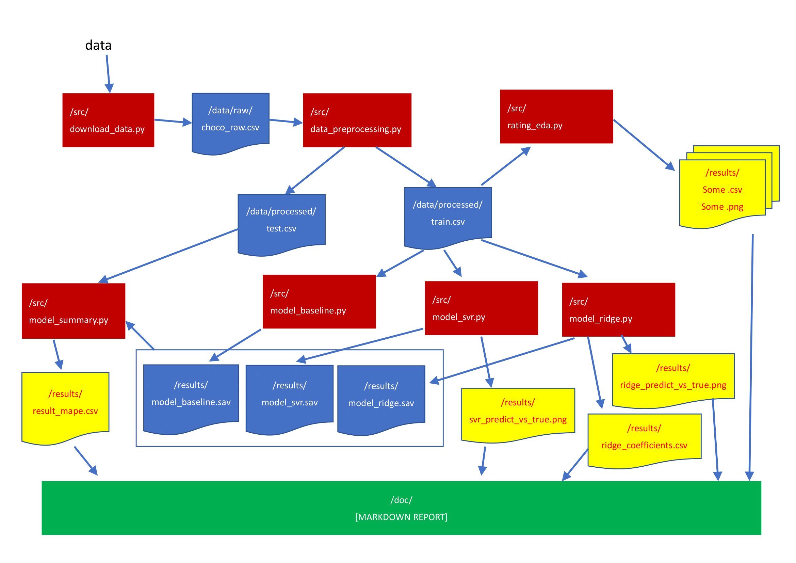
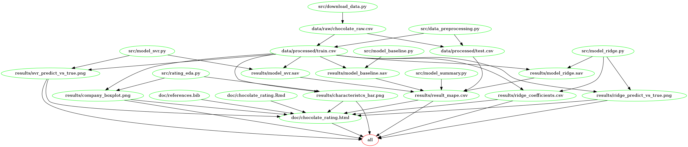

# Chocolate Rating Predictor

## Authors:
    - Robin Dhillon
    - Lisha Gao
    - Markus Nam
    - Eyre Hong

This data science project is created for DSCI 522 (Data Science Workflows); a course in the Master of Data Science program at the University of British Columbia.
    
# About 

Chocolate is a treat that is beloved globally. Different types of chocolates and their manufacturers are prevalent in different parts of the world. Hence, we decided to explore what features give us the best ratings for these various chocolates. Specifically, do features like `Manfacturer`, `Cocoa Percent` and `Country of Bean Origin` affect or influence the ratings of one chocolate over another? The main goal of this project is to explore this question using different machine learning models to predict chocolate ratings. Therefore, we perform an analysis based on a dataset of 2,588 chocolate ratings compiled by Brady Brelinsk from the Manhattan Chocolate Society. The dataset is available to the public [here](http://flavorsofcacao.com/chocolate_database.html).

Since we have a predictive research question, we separate the dataset into train data and test data (75% and 25%, respectively) to avoid violation of the Golden Rule. Initial exploratory data analysis (EDA) includes investigating the distributions of the aforementioned features as well as features such as the `Ingredients` and `Characteristics` of the chocolates. Plots such as barplots and boxplots are created of these features and saved in the [results](results) folder. The corresponding dataframes are saved as `csv` files in the [results](results) folder as well. As we delve deeper into the analysis, other plot types will most likely be used as well.

When we create the machine learning models, we preprocess the data using `StandardScaler()`, `OneHotEncoder()`, and `CountVectorizer()` to account for the numeric, categorical, and text columns of our dataset, respectively. For the predictions, we use regression models such as `Ridge` and `SVR (Support Vector Regression)` while using `DummyRegressor()` as the baseline. These models are fit to the training data and then evaluated by cross-validation. The scoring metric used is `neg_mean_absolute_percentage_error`. The models are further improved via hyperparameter optimization to obtain the best model, which are then used for predictions on the test data. The hyperparameter optimization is done via `RandomizedSearchCV`. Ultimately, these models are saved as `sav` files in [results](results). In the end, we check how our best model scores on the test data and the output is saved as `csv` files.

The workflow of how the data analysis should be run is shown in the flowchart/diagram below and the instructions are shown in the [Usage](#Usage):

**Figure 1**. Flowchart of analysis

# Usage

Below, we suggest three different ways to run this analysis:

#### 1\. Using Docker

*Note - the instructions in this section depends on running this in a unix shell (e.g., terminal or Git Bash). Specifically, these commands should be run on `git bash`.*

To replicate the analysis, install [Docker](https://www.docker.com/get-started/). Then clone this GitHub repository and run the following command at the command line/terminal from the root directory of this project to pull the docker image:

    docker pull eyrexh/chocolate_rating_docker

For **`Mac`** computers with an Intel processor, activate the docker image and run our project by using:

    docker run --rm -v "/$(pwd)":/home/chocolate eyrexh/chocolate_rating_docker make -C /home/chocolate all

If results already exist when this docker `make all` is used, or if the results of the above command need to be undone for a clean state of the repository, run the following command at the command line while still being at root directory of this project:

    docker run --rm -v "/$(pwd)":/home/chocolate eyrexh/chocolate_rating_docker make -C /home/chocolate clean

Note: If you are using M1 / M2 mac platform, please add the flag `--platform linux/amd64` when running the above `docker run` command.
i.e.

    docker run --rm --platform linux/amd64 -v "/$(pwd)":/home/chocolate eyrexh/chocolate_rating_docker make -C /home/chocolate all
AND

    docker run --rm --platform linux/amd64 -v "/$(pwd)":/home/chocolate eyrexh/chocolate_rating_docker make -C /home/chocolate clean

For **`Windows`** computers, use the following command to activate the docker image and run our project:

        docker run --rm -v "/$(pwd)"://home//chocolate eyrexh/chocolate_rating_docker make -C //home//chocolate all

For a clean repository, use the following command:

        docker run --rm -v "/$(pwd)"://home//chocolate eyrexh/chocolate_rating_docker make -C //home//chocolate clean
#### 2\. Using Make

If you do not having docker, we suggest using this method to replicate this analysis. First, please clone this repository and install the [dependencies](#dependencies) by referring to the [Installation](#installation) section. Next, while you are at the the root directory of this project, run the following command at the command line:

    make all

If results already exist when `make all` is used, or if the results of the above command need to be undone for a clean state of the repository, run the following command at the command line while still being at root directory of this project:

    make clean

#### 3\. If `make` is not available, then the following steps can be followed: 
Install the dependencies listed in [dependencies](#dependencies), run the command shown below from the root directory of this project to download the raw data, and then run the EDA file on JupyterLab.
- To download the data file: 
        
        python src/download_data.py --url=http://flavorsofcacao.com/database_w_REF.html --out_file=data/raw/chocolate_raw.csv
- To perform data cleaning, and split raw data file into train set and test set: 
        
        python src/data_preprocessing.py --in_file=data/raw/chocolate_raw.csv --out_dir=data/processed/
- To generate Exploratory data analysis (EDA) output: 
        
        python src/rating_eda.py --in_file=data/processed/train.csv --out_dir=results/
- To train baseline model: 
        
        python src/model_baseline.py --in_file=data/processed/train.csv --out_dir=results/
- To train SVR model: 
        
        python src/model_svr.py --in_file=data/processed/train.csv --out_dir=results/
- To train Ridge model: 
        
        python src/model_ridge.py --in_file=data/processed/train.csv --out_dir=results/
- To generate score of the models from test data set: 
        
        python src/model_summary.py --in_file=data/processed/test.csv --model_dir=results/ --out_dir=results/
- To generate the final analysis report: 
        
        Rscript -e "rmarkdown::render('doc/chocolate_rating.Rmd')"

# Installation
Create a conda environment by running the command below: 

    conda env create -f src/env-chocolate.yaml

To activate the environment, please run:

    conda activate chocolate

Install the necessary R packages: 

    Rscript -e "install.packages(c('knitr', 'kableExtra', 'tidyverse', 'caret', 'xfun'), repos='https://cran.rstudio.com/')"

# Dependencies
  - ipykernel
  - matplotlib>=3.2.2
  - scikit-learn>=1.1.3
  - requests>=2.24.0
  - graphviz
  - python-graphviz
  - eli5
  - shap
  - jinja2
  - altair_saver
  - selenium<4.3.0
  - pandas<1.5
  - imbalanced-learn
  - pandas-profiling
  - ipywidgets
  - lxml
  - pandoc
  - pip
  - lightgbm
  - pip:
    - joblib==1.1.0
    - mglearn
    - psutil>=5.7.2
    - vl-convert-python
    - docopt-ng

# Dependency Diagram

# License
The materials here for Chocolate Rating Predictor are licensed under the **Creative Commons Attribution 2.5 Canada License** ([CC BY 2.5 CA](https://creativecommons.org/licenses/by/2.5/ca/)). MIT License

# References

- Brady Brelinski and Andrea Brelinski. 2022. "chocolate_database" Flavor of Cacao, Mahanttan Chocolate Society http://flavorsofcacao.com

- Roger D. Peng and Elizabeth Matsui. 2017. "The Art of Data Science" https://bookdown.org/rdpeng/artofdatascience/ 